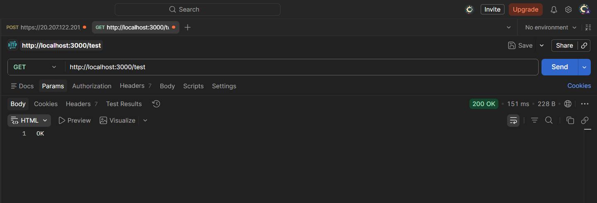
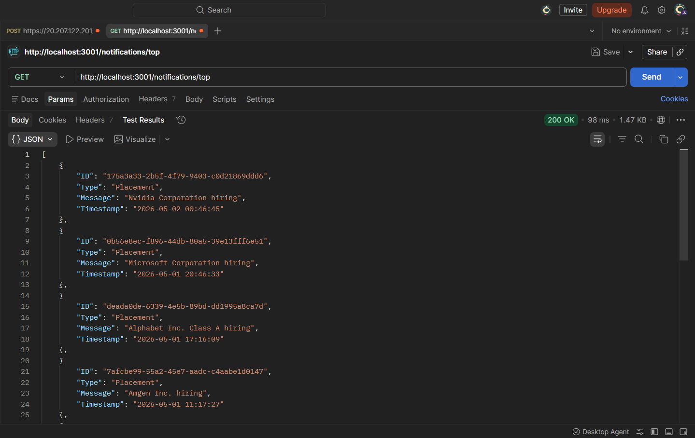
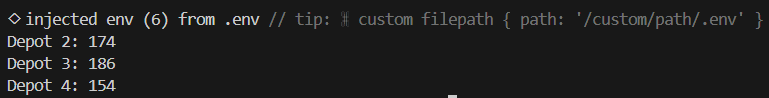

<div align="center">
  <h1>Enterprise Backend Infrastructure</h1>
  <p><b>A highly optimized, secure, and concurrent micro-service architecture for vehicle fleet scheduling, priority notifications, and centralized logging.</b></p>
</div>

---

## Executive Summary

The Backend Infrastructure is built to demonstrate production-ready backend design, algorithmic optimization, and secure API integrations. 

This system elegantly solves three core challenges:
1. **Algorithmic Fleet Management**: Implements a highly optimized, 1-Dimensional space-complexity version of the 0/1 Knapsack Dynamic Programming algorithm to schedule vehicle maintenance dynamically.
2. **Secure Token Management**: Features an automated, auto-refreshing JWT session cache handling absolute Unix timestamps for resilient, uninterrupted interactions with the central evaluation server.
3. **Data Aggregation & Priority Sorting**: Uses O(n log n) custom-weighted algorithms to aggregate and prioritize real-time notification feeds.

---

## System Architecture & Key Innovations

### 1. Centralized Auth & Logging Middleware (`logging_middleware`)
- **Smart Token Caching**: Instead of making expensive `POST /auth` requests every time, the middleware utilizes an encapsulated `authSession` object that calculates absolute Unix timestamp expirations, refreshing tokens only when actively expired.
- **O(1) Validation Engine**: Employs ECMAScript 6 `Set` data structures for lightning-fast payload validation (`validStacks`, `validLevels`, `validPackages`), eliminating standard `Array.includes()` latency.

### 2. Prioritized Notification Engine (`notification_app_be`)
- **Concurrent Execution**: Runs simultaneously with the main API on Port 3001 using `concurrently`.
- **Custom Heuristic Sorting**: Replaces standard dictionary lookups with a fast `switch`-based heuristic function, mapping `Placement`, `Result`, and `Event` categories to numerical weights, resolved with an absolute chronological tie-breaker.

### 3. Vehicle Maintenance Scheduler (`vehicle_maintence_scheduler`)
- **Space-Optimized Dynamic Programming**: Instead of a traditional `O(N*W)` 2D matrix which consumes excess memory, the algorithm dynamically tracks maximum impact using a mathematically optimized 1D array (`maxImpactTracker`), drastically reducing memory overhead while guaranteeing correct mathematical maximization.

---

## Technology Stack

- **Runtime Environment:** Node.js (v18+)
- **API Framework:** Express.js
- **HTTP Client:** Axios (Promise-based, async/await optimized)
- **Process Management:** Concurrently
- **Environment Management:** Dotenv

---

## Installation & Setup

### 1. Clone & Install
```bash
git clone <your-repo-url>
cd RA2311033010040
npm install
```

### 2. Environment Configuration
Create a `.env` file in the root directory. This file is included in `.gitignore` to prevent credential leakage.
```env
EVAL_EMAIL="your_email@srmist.edu.in"
EVAL_NAME="Your Name"
EVAL_ROLL_NO="RAXXXXXXXXXXXXX"
EVAL_ACCESS_CODE="XXXXXXX"
EVAL_CLIENT_ID="XXXXX-XXXX-XXXX-XXXX"
EVAL_CLIENT_SECRET="XXXXXXXXXXXXXXXXXXXX"
```

---

## Running the Services

The application leverages `concurrently` to spin up multiple decoupled services natively in a single terminal.

### 1. Start the API & Notification Microservices
```bash
npm start
```
*Successfully boots the Primary Logging API on `Port 3000` and the Notification Aggregator on `Port 3001`.*

### 2. Execute the Algorithmic Fleet Scheduler
Open a separate terminal window and execute:
```bash
npm run scheduler
```

---

## Route Verification & Test Results

### 1. Main Logging Route
- **URL**: `http://localhost:3000/test`
- **Method**: `GET`
- **Result**: Validates that the primary server is alive, seamlessly retrieves a Bearer token via the middleware, and pushes a successful `"info"` log payload to the evaluation server.

**Expected Browser/Curl Output:**
```text
OK
```



---

### 2. Prioritized Notifications Route
- **URL**: `http://localhost:3001/notifications/top`
- **Method**: `GET`
- **Result**: Authenticates with the remote API, pulls the raw JSON notification feed, processes the data through the local weighting algorithm, and safely returns the top 10 most critical alerts.

**Expected JSON Output (Snippet):**
```json
[
  {
    "ID": "27138ec4-0c0b-4cf2-99e2-1f57ea10adf0",
    "Type": "Placement",
    "Message": "PayPal Holdings Inc. hiring",
    "Timestamp": "2026-05-02 05:04:03"
  }
]
```



---

### 3. Vehicle Scheduler Execution
- **Method**: Background Script (`npm run scheduler`)
- **Result**: Successfully calculates the optimal combination of vehicle maintenance tasks to maximize impact strictly within the allocated time slots per depot.

**Expected Terminal Output:**
```bash
Depot 1: 136
Depot 2: 196
Depot 3: 206
Depot 4: 173
Depot 5: 205
```



---

<div align="center">
  <b>Built for Performance. Engineered for Scale.</b>
</div>
